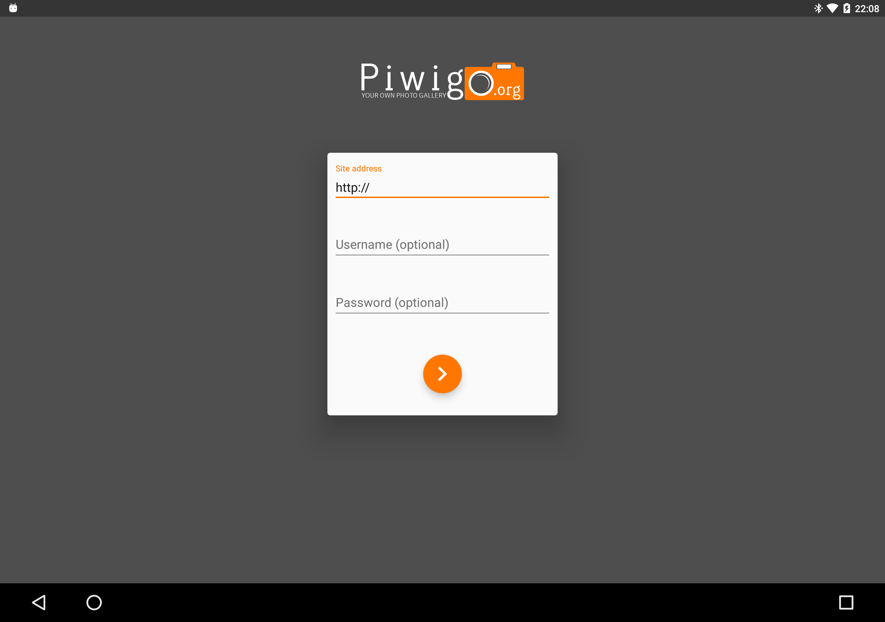

# Piwigo for Android

Currently under development by the Piwigo-Mobile team, please get in touch if you're interested in contributing to the project.

If you're considering contributing, a working knowledge of the following would be extremely useful:

* MVVM with Android Data Binding
* Dependency injection with Dagger 2
* Unit testing with Mockito and Robolectric

## Progress

### Login

#### Done

- Guest login (see Settings -> Accounts after successful login)
- User login (see Settings -> Accounts after successful login)
- Should scale well on all phone and table screens
- Animations on most devices

### Main screen

## Licensing
The project is delivered under the GNU General Public License (GPL) in version 3, or (at your option) any later version of that license. By submitting code or artwork to the project by patches, pull request or any other form the authors guarantee that it is either their own work and they accept to distribute their content under this license or the contribution is (re-)distributable under the terms of this license. If not specifically marked with a dedicated copyright notice, the copyright of the source code is transfered to to Piwigo project as far as permitted by applicable law. If necessary for legal reasons the source code author(s) shall be extracted from the meta data of the version control system.
Copyright notices in this project are mostly given with a reference to the year in form of xxxx-yyyy as a short cut with the meaning, that every year in the given range is a copyrightable year.

## Privacy
Piwigo-Android and its authors have a deep interest to respect your privacy. Therefore this app is designed to not track your behaviour and keep your data in your hands. It is recommended to host your Piwigo gallery by yourself and use only encrypted connections via HTTPS. The full <a href="https://piwigo.org/mobile-apps-privacy-policy">privacy policy is available on the website</a> of Piwigo and within he app itself.
