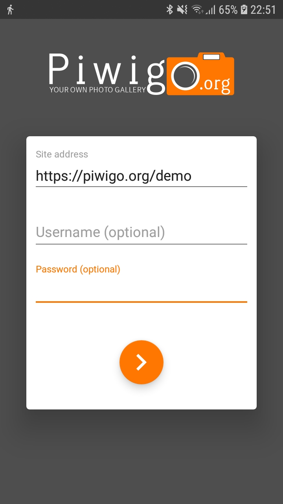
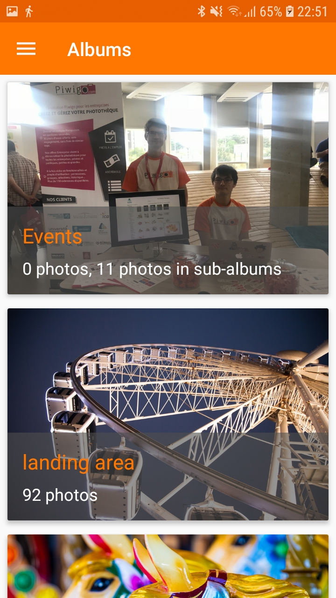
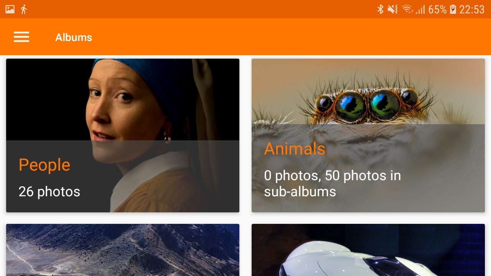
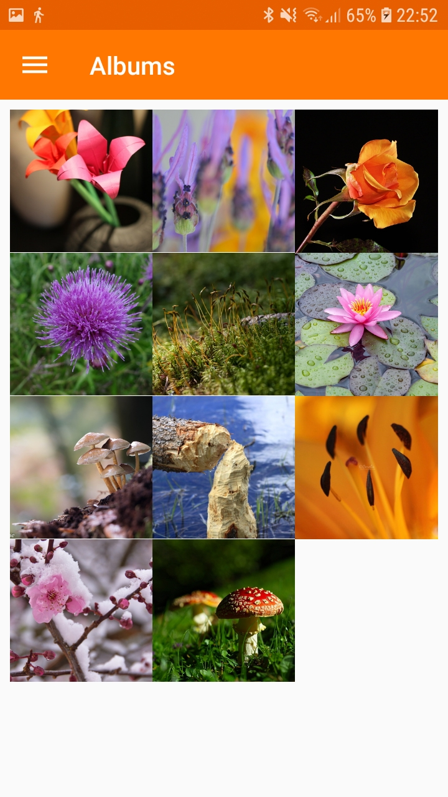

# Piwigo for Android

Software is never finished and this APP is still under development by the Piwigo-Mobile team but it is already usable. If you face trouble please check the [FAQs](https://github.com/Piwigo/Piwigo-Android/wiki/FAQ:-Frequently-Asked-Questions) and [create tickets](https://github.com/Piwigo/Piwigo-Android/issues/new/choose) in case you detect a bug.

## Install

## Login

To show your photos enter the URL of your gallery (the web address you also use in the browser) into the server address field. For a quick try you can enter http://www.piwigo.org/demo. Keep username and password empty for guest login.

## Supported features

- Navigation through albums
- Full screen photo view
- Upload
- Guest login (by keeping user name and password fields empty)
- User login (see Settings -> Accounts after successful login)
- Multiple accounts
- SSL protected galleries but also plain HTTP access (which is recommended only in secured private networks)

### Main screen

## Licensing
The project is delivered under the GNU General Public License (GPL) in version 3, or (at your option) any later version of that license. By submitting code or artwork to the project by patches, pull request or any other form the authors guarantee that it is either their own work and they accept to distribute their content under this license or the contribution is (re-)distributable under the terms of this license. If not specifically marked with a dedicated copyright notice, the copyright of the source code is transfered to to Piwigo project as far as permitted by applicable law. If necessary for legal reasons the source code author(s) shall be extracted from the meta data of the version control system.
Copyright notices in this project are mostly given with a reference to the year in form of xxxx-yyyy as a short cut with the meaning, that every year in the given range is a copyrightable year.

## Privacy
Piwigo-Android and its authors have a deep interest to respect your privacy. Therefore this app is designed to not track your behaviour and keep your data in your hands. It is recommended to host your Piwigo gallery by yourself and use only encrypted connections via HTTPS. The full <a href="https://piwigo.org/mobile-apps-privacy-policy">privacy policy is available on the website</a> of Piwigo and within he app itself.

## Contributions
As most free / open source software projects we have happy if are willing to invest some time into this project and contribute. We are always looking for translators, documentators, testers and for sure also programmers. Translations are done on the [platform Crowdin](https://crowdin.com/project/piwigo-android) and documentation mainly here in this README file and the [wiki](https://github.com/Piwigo/Piwigo-Android/wiki). If you consider contributing code best is to choose one of the tickets where you have a personal interest to get it done and comment on it with a proposal hwo you plan to solve the issue. Some where we believe they could be a good starting point are labeled with [help wanted](https://github.com/Piwigo/Piwigo-Android/issues?q=is%3Aissue+is%3Aopen+label%3A%22help+wanted%22). For coding it would be great to have experience with MVVM, Android Data Binding, Depencency injections with Dagger 2 or Unit testing with Mockito and Robolectric. But even in case you have just a little Java experience and want to support we will help you to ramp up and guide you to learn the things you need for this project.
